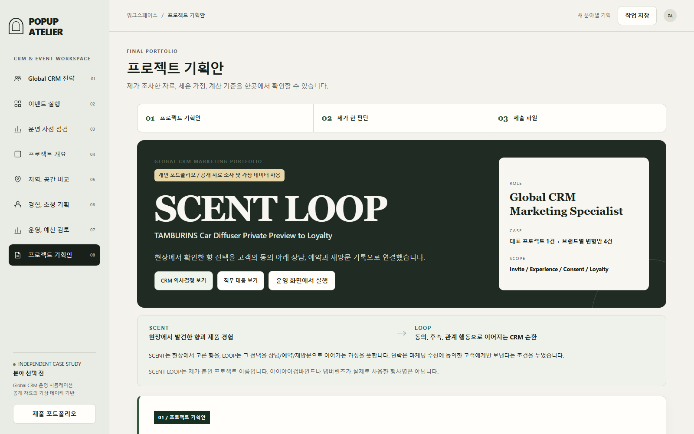

# Global CRM Event Operations

VIP 행사의 초청 이유부터 행사 후 담당 업무까지 연결하는 고객 관계 관리(CRM) 운영안입니다.

[SCENT LOOP 소개 PDF](public/downloads/SCENT-LOOP-Global-CRM-Portfolio.pdf) | [Excel 운영표](public/downloads/SCENT-LOOP-CRM-Operations.xlsx) | [문서 안내](docs/README.md)

## 30초 안내

- **문제:** VIP 행사 전후의 고객 정보, 수신 동의, 담당 업무가 흩어지면 다음 행동이 누락될 수 있습니다.
- **바로 보기:** [화면 미리보기](assets/project-overview.png), [소개 PDF](public/downloads/SCENT-LOOP-Global-CRM-Portfolio.pdf), [Excel 운영표](public/downloads/SCENT-LOOP-CRM-Operations.xlsx)에서 고객 흐름과 인계 기준을 확인합니다.
- **확인 범위:** 가상 행사와 공개 조사 자료를 바탕으로 한 개인 포트폴리오입니다. 실제 고객 자료와 운영 성과는 포함하지 않습니다.

## 소개

행사 전후의 고객 정보가 여러 문서에 흩어지면, 초청 이유와 현장 경험, 마케팅 동의, 상담 요청이 이어지지 않아 담당자가 다음 행동을 놓칠 수 있습니다. 이 문제를 풀기 위해 공개된 브랜드 행사 사례와 CRM 업무를 맡는 상황을 상상하며 고객 흐름과 운영 기준을 설계했습니다.

대표 기획안 **SCENT LOOP**는 가상의 탬버린즈 카디퓨저 프라이빗 프리뷰입니다. 현장에서 고른 향을 후속 상담, 예약과 재방문으로 이어가는 흐름을 뜻하며 실제 브랜드가 사용한 행사명은 아닙니다. 실제 행사 운영 경험을 주장하지 않고 공개 조사와 가상 자료로 운영 구조를 설계했습니다.

## 목차

- [고객 흐름과 운영 판단](#고객-흐름과-운영-판단)
- [가상 자료와 측정 기준](#가상-자료와-측정-기준)
- [확인한 결과와 남은 검증](#확인한-결과와-남은-검증)
- [결과물 확인과 실행](#결과물-확인과-실행)
- [문서와 코드 안내](#문서와-코드-안내)

## 고객 흐름과 운영 판단

**초청 → 현장 경험 → 마케팅 동의 → 후속 상담과 재방문**

| 단계 | 관리할 정보 | 판단의 목적 |
|---|---|---|
| 행사 전 | 고객군별 초청 이유, 제외 조건과 담당자 | 누구를 왜 초대하는지 설명합니다. |
| 현장 | 참석 여부, 제품과 향에 대한 관심, 상담 요청 | 참석 수와 실제 관심을 구분합니다. |
| 동의 | 행사 참석과 별도로 확인한 마케팅 수신 동의 | 후속 연락이 가능한 조건을 분명히 합니다. |
| 행사 후 | 다음 행동, 담당자, 기한과 완료 근거 | 상담·예약 요청이 인계 과정에서 빠지지 않게 합니다. |

행사 8주 전부터 행사 후 30일까지 고객과 운영팀의 일정을 연결했습니다. 리테일, 콘텐츠와 디자인 담당자가 확인할 수용 인원, 재고, 공개 범위와 초청물 승인도 기획에 포함했습니다.



## 가상 자료와 측정 기준

가상 초청 고객 240명을 기존 우수·재구매 고객 70명, 고관여 잠재 고객 80명, 콘텐츠 크리에이터 30명, 휴면 VIP 60명으로 나눴습니다. 각 그룹의 선정 이유와 다음 연락 조건은 [기획안](docs/PROJECT-PLAN.md)에 있습니다.

계산용 흐름은 초청 240명 → 참석 의사 응답 156명 → 방문 확정 132명 → 참석 116명 → 체험 104명 → 마케팅 동의 82명 → 후속 반응 47명 → 관계 행동 28명입니다. 각 단계의 분모를 고정하고 참석과 마케팅 동의를 따로 셉니다. 이 수치는 실제 행사 성과가 아닙니다.

공식 채널, 기사와 개별 방문 후기는 출처의 성격을 구분해 사용했습니다. 개인 후기 한 건을 전체 고객의 공통 불편으로 확대하거나 직접 방문한 경험으로 표현하지 않았습니다.

## 확인한 결과와 남은 검증

고객 단계 합계, 전환율 계산, 누락 업무와 출처 표시를 자동 검사하고 PDF, Excel과 구현의 핵심 수치를 대조했습니다. 배포용 파일 생성과 화면·API 경로를 확인하는 검사도 제공합니다.

실제 회사의 고객 등급, 국가별 동의 기준, 내부 시스템과 담당자의 기록 부담은 확인하지 못했습니다. 초청 기준과 후속 행동이 재방문이나 구매를 늘리는지도 아직 검증하지 않았습니다. 실제 적용 전에는 현장 담당자와 항목 및 기준을 맞춰야 합니다.

## 결과물 확인과 실행

**PDF → Excel → 기획·조사 문서** 순서로 읽으면 판단과 실행 구조를 함께 볼 수 있습니다. 운영 웹 화면은 소유자 전용이므로 외부 방문자는 제출자료나 로컬 실행을 이용합니다.

Node.js 22 이상에서 저장소 최상위 폴더의 터미널에 입력합니다.

```sh
npm ci
npm start
```

터미널에 표시된 주소를 브라우저로 엽니다. 서울시 데이터 연결 설정은 [실행 안내](docs/RUNNING.md)를 참고하세요.

```sh
npm test
npm run build
node verify-worker.mjs
```

## 문서와 코드 안내

| 목적 | 위치 |
|---|---|
| 요구사항과 완료 조건 | [제품 기획서](docs/PRD.md) |
| 고객군, 일정과 측정 기준 | [프로젝트 기획안](docs/PROJECT-PLAN.md) |
| 조사 원문과 사용 범위 | [조사 자료](docs/RESEARCH-SOURCES.md) |
| 직무 연결과 남은 확인 | [기획 판단과 검증 과제](docs/PROJECT-NOTES.md) |
| 구현과 자동 검사 | [웹 코드](public/), [자동 검사](tests/) |

제작자가 기획 범위와 판단 기준을 정하고 문구, 화면과 계산식을 확인했습니다. 실제 고객 명단이나 내부 매출은 사용하지 않았으며 초청장 발송, 회원 가입과 결제는 진행하지 않았습니다.
